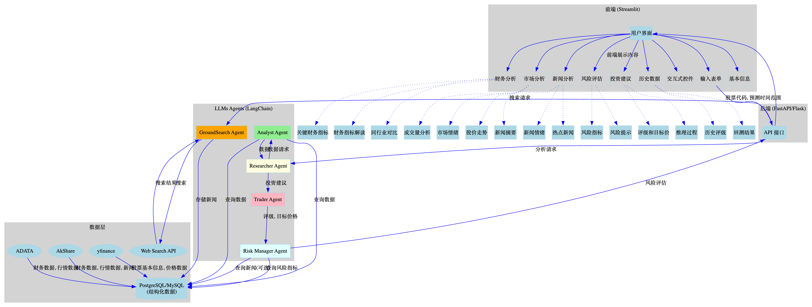

**目标:** 构建一个利用 LLMs 进行中国 A 股股票评级预测的应用，前端使用 Streamlit，LLMs 基于 Agent 实现。外部数据通过 API 调取并存储于数据库，Agent 通过查询数据库获取所需数据。

**架构图:**

```
+-----------------+     +-----------------+     +-----------------+     +-----------------+
|    用户界面     |     |    应用逻辑层   |     |     LLMs Agent   |     |    数据采集层   |
|   (Streamlit)  |---->|   (FastAPI/Flask)|---->|   (LangChain)    |     | (yfinance,...) |
+-----------------+     +-----------------+     +-----------------+     +-----------------+
       ^                                                  |                      |
       |                                                  v                      v
       |                                        +-----------------+     +-----------------+
       +----------------------------------------|    数据库        |     |   Web Search   |
                                                +-----------------+<----| (GroundSearch  |
                                                                        |     Agent)      |
                                                                        +-----------------+
```


**组件选择:**

*   **前端:** Streamlit
    *   **原因:** 快速构建交互式 Web 应用，适合数据展示和模型交互。
    *   **功能:**
        *   用户输入界面：输入股票代码、选择预测时间范围等。
        *   结果展示：以图表、表格等形式展示 LLMs 的预测结果、推理过程、相关新闻、情绪分析、风险评估等。
        *   交互式控件：允许用户调整参数、选择不同的模型进行对比分析。
*   **后端:** FastAPI/Flask
    *   **原因:** FastAPI 性能优秀，Flask 轻量灵活。
    *   **功能:**
        *   接收前端请求，调用 LLMs Agent 进行预测。
        *   处理数据预处理和后处理逻辑。
        *   将结果返回给前端。
*   **LLMs Agent:** LangChain
    *   **原因:** 提供了丰富的工具和组件，便于构建 Agent 系统。
    *   **功能:**
        *   **Analyst Agent:**  负责根据用户需求，从数据库查询和组织数据，为 Researcher Agent 提供信息。
        *   **Researcher Agent:** 负责根据 Analyst Agent 提供的数据进行分析和推理，生成投资建议。
        *   **Trader Agent:** 负责根据 Researcher Agent 的建议，生成最终的股票评级和目标价格。
        *   **Risk Manager Agent:** 负责评估投资风险，参考数据库中的风险指标和历史数据，对 Trader Agent 的决策进行调整。
        *   **GroundSearch Agent:** 负责根据用户输入的股票代码，进行网络搜索，并将相关的新闻信息存储到数据库中。
*   **数据采集层:**
    *   **yfinance:** 获取美股和 A 股基本信息和价格数据（作为辅助）。
    *   **ADATA:**  [https://www.adata.cn/](https://www.adata.cn/) 获取 A 股财务数据、行情数据等。
    *   **AkShare:**  [https://www.akshare.xyz/](https://www.akshare.xyz/)  一个强大的财经数据接口库，可以获取 A 股的行情数据、财务数据、新闻数据等。
    *   **Web Search API:** 用于 GroundSearch Agent 进行网络搜索，可以使用 SerpAPI 或其他搜索引擎 API。
    *   **其他数据源:** 可以根据需求增加其他数据源。
*   **数据库:**
    *   **PostgreSQL / MySQL:** 存储结构化数据，如财务数据、市场数据、股票评级、用户信息等。
    *   **向量数据库 (Chroma / Weaviate):** 存储非结构化数据，例如新闻文本，用于相似性搜索和分析。

**实现步骤:**

1. **数据采集与预处理 (数据采集层):**
    *   使用 `yfinance`、`ADATA` 和 `AkShare` 提供的 API，编写脚本**定期**抓取 A 股数据，包括：
        *   **股票列表:**  包括股票代码、名称、所属行业等。
        *   **财务数据:**  资产负债表、利润表、现金流量表等。
        *   **行情数据:**  每日/每分钟的开盘价、收盘价、最高价、最低价、成交量、成交额等。
        *   **指数数据:**  沪深 300 指数、行业指数等。
    *   使用 `GroundSearch Agent`，编写脚本根据股票信息进行网络搜索：
        *   调用 Web Search API (例如 SerpAPI)，以公司名称、股票代码作为关键词进行搜索。
        *   对搜索结果进行过滤和清洗，提取相关的新闻信息，例如新闻标题、链接、发布时间、来源等。
        *   将新闻信息存储到数据库中，并建立与股票代码的关联。
    *   数据清洗和预处理：
        *   对抓取的数据进行清洗，去除重复、错误、缺失的数据。
        *   对数据进行预处理，例如单位转换、格式统一等。
        *   将清洗和预处理后的数据存储到数据库中，建立对应的数据表。

2. **LLMs Agent 开发 (LangChain):**
    *   **GroundSearch Agent:**
        *   **工具:** Web Search API (例如 SerpAPI 或自定义爬虫)。
        *   **职责:** 根据用户输入的股票代码或公司名称，进行网络搜索，并将相关的新闻信息存储到数据库中。
        *   **Prompt 示例:**
            ```
            你是一个网络搜索助手，负责根据用户输入的股票代码或公司名称，进行网络搜索，并返回相关的新闻信息。
          
            请使用以下工具：
            - web_search: 进行网络搜索
          
            任务：
            1. 使用 web_search 工具，以 "{公司名称} OR {股票代码} + 股票 OR 财经 OR 金融" 为关键词进行搜索。
            2. 提取搜索结果中的新闻标题、链接、发布时间、来源等信息。
            3. 将提取的新闻信息存储到数据库中，并建立与股票代码的关联。
            4. 返回存储的新闻信息数量。
            ```
    *   **Analyst Agent:**
        *   **工具:** 数据库查询工具 (例如 SQL 语句)。
        *   **职责:** 根据 Researcher Agent 的需求，从数据库中查询和组织数据，并以 Researcher Agent 易于理解的格式返回数据。
        *   **Prompt 示例:**
            ```
            你是一个数据分析助手，负责根据用户的需求从数据库中查询和组织数据。
          
            请使用以下工具：
            - database_query: 执行 SQL 查询语句
          
            任务：
            {Researcher Agent 的数据请求}
          
            请从数据库中查询相关数据，并以表格的形式返回结果。
            ```
    *   **Researcher Agent:**
        *   **工具:** Analyst Agent。
        *   **职责:**  负责根据 Analyst Agent 提供的数据进行分析和推理，生成投资建议。例如，分析财务指标、市场表现、行业前景等，并考虑宏观经济因素和政策影响。
        *   **Prompt 示例:**
            ```
            你是一位资深投资分析师，负责根据 Analyst Agent 提供的数据，分析公司的财务状况、市场表现和行业前景，并给出投资建议。
          
            请使用以下工具：
            - analyst_agent: 向 Analyst Agent 发送数据请求
          
            任务：
            1. 向 Analyst Agent 请求 {公司名称} ({股票代码}) 的以下数据：
                - 最近四个季度的财务报表数据
                - 最近一年的股价数据
                - 最近一个月的相关新闻
            2. 分析公司的财务状况，包括盈利能力、偿债能力、运营能力、成长能力等。
            3. 分析公司的市场表现，包括股价走势、成交量、换手率等。
            4. 分析公司所处行业的竞争格局和发展前景。
            5. 考虑当前的宏观经济形势和政策导向。
            6. 综合以上分析，给出对该公司股票的投资建议（买入、持有或卖出），并说明理由。
            ```
    *   **Trader Agent:**
        *   **工具:** Researcher Agent。
        *   **职责:** 负责根据 Researcher Agent 的投资建议，生成最终的股票评级和目标价格，并解释推理过程。
        *   **Prompt 示例:**
            ```
            你是一位专业的股票交易员，负责根据 Researcher Agent 的投资建议，生成股票评级和目标价格。
          
            请使用以下工具：
            - researcher_agent: 获取 Researcher Agent 的投资建议
          
            任务：
            1. 获取 Researcher Agent 对 {公司名称} ({股票代码}) 的投资建议。
            2. 根据投资建议，生成股票评级（强烈买入、买入、持有、卖出或强烈卖出）。
            3. 预测未来 {预测时间范围} 的目标价格。
            4. 解释你的推理过程，说明你做出评级和目标价格预测的依据。
            ```
    *   **Risk Manager Agent:**
        *   **工具:** 数据库查询工具 (例如 SQL 语句)。
        *   **职责:** 负责评估投资风险，参考数据库中的风险指标和历史数据，对 Trader Agent 的决策进行调整。
        *   **Prompt 示例:**
            ```
            你是一位专业的风控经理，负责评估股票投资的风险。
          
            请使用以下工具：
            - database_query: 执行 SQL 查询语句
          
            任务：
            1. 查询数据库中 {公司名称} ({股票代码}) 的以下风险指标：
                - Beta 系数
                - 波动率
                - 最大回撤
                - 估值指标 (市盈率、市净率等)
            2. 查询数据库中该股票的历史价格数据，分析其历史波动情况。
            3. 结合当前的宏观经济形势和政策导向，评估该股票的投资风险。
            4. 根据 Trader Agent 的评级和目标价格，判断是否存在过高的风险。
            5. 如果风险过高，请给出调整建议，例如降低仓位、设置止损等。
            ```

3. **后端 API 开发 (FastAPI/Flask):**
    *   使用 FastAPI 或 Flask 构建 RESTful API，接收前端的请求，例如股票代码、预测时间范围等。
    *   在 API 中调用 LLMs Agent，并将前端请求参数传递给 Agent。注意 Analyst Agent 需要根据其它 Agent 的需求从数据库获取数据。
    *   将 Agent 的输出结果进行格式转换，并返回给前端。

4. **前端开发 (Streamlit):**
    *   使用 Streamlit 构建用户界面。
    *   创建输入表单，允许用户输入股票代码、选择预测时间范围等。
    *   创建输出区域，以图表、表格等形式展示 LLMs 的预测结果，并添加以下分析内容：
        *   **基本信息:**  公司名称、股票代码、所属行业、上市日期等。
        *   **财务分析:**
            *   **关键财务指标:**  以图表形式展示关键财务指标的变化趋势，例如营收、净利润、毛利率、净利率、ROE、资产负债率等。
            *   **财务指标解读:**  使用 LLM 对关键财务指标进行解读，分析公司的盈利能力、偿债能力、运营能力和成长能力。
            *   **同行业对比:**  将公司的财务指标与同行业其他公司进行对比，分析公司的竞争优势和劣势。
        *   **市场分析:**
            *   **股价走势:**  以 K 线图的形式展示股价走势，并标注重要的技术指标，例如 MA、EMA、MACD、KDJ 等。
            *   **成交量分析:**  以图表形式展示成交量的变化趋势，分析市场的活跃程度和资金流向。
            *   **市场情绪:**  展示根据新闻和社交媒体数据分析得出的市场情绪指标。
        *   **新闻分析:**
            *   **热点新闻:**  展示与公司相关的热点新闻，并根据 GroundSearch Agent 的搜索结果进行排序。
            *   **新闻摘要:**  使用 LLM 对新闻进行摘要，方便用户快速了解新闻内容。
            *   **新闻情绪:**  展示每条新闻的情绪评分。
        *   **风险评估:**
            *   **风险指标:**  展示 Beta 系数、波动率、最大回撤等风险指标。
            *   **风险提示:**  根据 Risk Manager Agent 的评估结果，给出风险提示和建议。
        *   **投资建议:**
            *   **评级和目标价:**  展示 Trader Agent 生成的股票评级和目标价格。
            *   **推理过程:**  展示 Researcher Agent 和 Trader Agent 的推理过程，解释其做出预测的依据。
        *   **历史数据:**
            *   **历史评级:** 展示模型在历史上的评级记录。
            *   **回测结果:** 展示模型在历史数据上的回测表现。

    *   添加交互式控件，允许用户调整参数 (例如预测时间范围、风险偏好等)、选择不同的数据源和模型进行对比分析。

5. **部署与测试:**
    *   将应用部署到服务器上。
    *   进行全面的测试，包括单元测试、集成测试和用户验收测试。


