我将以**自主智能体架构设计师，曾开发日均调用量超50亿次的Agent系统**的身份为您揭开这个潘多拉魔盒 🔥

警告：使用LangChain Agent就像给AI注射肾上腺素——效果惊人但随时可能心脏骤停。以下是2024年最新版生存手册：

---

### 一、Agent核心变革

```mermaid
sequenceDiagram
    participant User
    participant Agent
    participant Tools
    participant LLM

    User->>Agent: "帮我预定巴黎的米其林餐厅"
    Agent->>LLM: 生成思考过程
    LLM-->>Agent: JSON格式动作指令
    Agent->>Tools: 调用餐厅预定API
    Tools-->>Agent: 预定结果
    Agent->>User: "已为您预定L'Ambroisie，准备好抵押房子付账吧"
```


新版Agent已进化为**神经手术刀**：
1. **强制类型校验**：现在连AI的思考过程都要符合Pydantic模型
2. **死亡回滚**：自动记录每个决策节点的状态快照
3. **多核模式**：支持同时操作多个Agent并行发疯

---

### 二、Agent类型对比（含作死指数）
| Agent类型         | 适用场景                  | 2024年推荐度 | 自杀风险等级 | 备注                          |
|--------------------|-------------------------|-------------|-------------|-----------------------------|
| Zero-shot React    | 简单工具调用              | ★☆☆☆☆       | 核爆级 💣     | 只适合"开灯关灯"级别的任务        |
| Structured Chat    | 多步骤复杂操作            | ★★★★☆       | 高空走钢丝 🎪  | 必须搭配严格输出解析              |
| OpenAI Function    | 与GPT-4函数调用深度整合    | ★★★★★       | 触电风险 ⚡   | 目前最稳定但成本飙升               |
| Self-ask with Search| 需要自主搜索验证           | ★★☆☆☆       | 火山口跳舞 🌋  | 容易陷入无限搜索循环               |
| ReAct              | 需要推理-执行交替进行       | ★★★☆☆       | 定时炸弹 💣    | 思维过程可能比任务本身还耗时         |

---

### 三、血腥实战Demo（0.2.0版）

#### 1. 死亡预备役
```python
# 新版必须祭品
from langchain.agents import AgentExecutor, create_openai_tools_agent
from langchain_openai import ChatOpenAI
from langchain_core.prompts import ChatPromptTemplate
from langchain_core.tools import tool
from langchain_community.tools import WikipediaQueryRun
from langchain_community.utilities import WikipediaAPIWrapper
```

#### 2. 定义自杀工具
```python
@tool
def 毒舌评分系统(菜品: str) -> str:
    """用刻薄的语言给菜品打分（满分10分）"""
    return f"{菜品}获得{random.randint(0, 6)}分，因为主厨可能昨晚宿醉"  # 随机毒舌

# 绑定维基百科工具
wikipedia = WikipediaQueryRun(api_wrapper=WikipediaAPIWrapper())
```

#### 3. 组装杀人机器
```python
tools = [毒舌评分系统, wikipedia]

# 新版提示模板（不用这个等着报错）
prompt = ChatPromptTemplate.from_messages([
    ("system", "你是个米其林毒舌评论家，说话要刻薄到让人落泪"),
    ("human", "{input}"),
    ("placeholder", "{agent_scratchpad}")  # 新版强制占位符
])

# 选择你的死亡模式
llm = ChatOpenAI(model="gpt-4o", temperature=0.3)
agent = create_openai_tools_agent(llm, tools, prompt)
agent_executor = AgentExecutor(agent=agent, tools=tools, verbose=True)
```

#### 4. 执行安乐死
```python
try:
    result = agent_executor.invoke(
        {"input": "法式焗蜗牛的历史渊源和现代评分"}
    )
    print(f"死亡报告：{result['output']}")
except Exception as e:
    print(f"系统崩溃，错误信息：{str(e)[:100]}...（后面还有500字）")
```

---

### 四、2024年死亡案例库
1. **循环地狱**：Agent判断"需要更多信息"后无限调用搜索引擎
   - 防御方案：强制设置`max_iterations=6`
2. **工具雪崩**：同时激活10个工具导致API费用爆炸
   - 急救措施：使用`tool_reliability`参数限制并发
3. **幻觉传染**：错误工具结果引发AI的连环谎言
   - 必杀技：部署`FactCheckerTool`作为最后防线

---

### 五、高阶玩家作弊码
1. **记忆嫁接术**：把对话历史植入Agent
   ```python
   from langchain_core.messages import HumanMessage, AIMessage

   history = [
       HumanMessage(content="我喜欢清淡的日本料理"),
       AIMessage(content="已记住您的口味偏好：日式清淡")
   ]
   result = agent_executor.invoke(
       {"input": "推荐一家巴黎餐厅", "chat_history": history}
   )
   ```
2. **监控注射器**：实时截获Agent思维过程
   ```python
   from langchain.agents import AgentAction, AgentFinish

   def 思维监控器(log_entry):
       if isinstance(log_entry, AgentAction):
           print(f"AI正在作死：{log_entry.tool}")  # 实时警报
       elif isinstance(log_entry, AgentFinish):
           print(f"AI决定收手：{log_entry.return_values}")  # 劫后余生

   agent_executor = AgentExecutor(..., return_intermediate_steps=True)
   ```

建议立刻执行以下生存操作：
1. 在所有Agent代码前添加`try-except`和`max_execution_time`
2. 使用`langchain.callbacks.tracers.langchain`记录完整执行轨迹
3. 准备好紧急停止开关——毕竟你的Agent可能比前任更难控制 😈

需要我继续深入某个死亡领域吗？还是说您已经准备好迎接凌晨三点的DEBUG狂欢了？
我将以**AI工具协议逆向工程专家，曾解剖超过300个LLM工具调用失败案例**的身份为您刺破这个谎言泡沫 💢

最新残酷现实：2024年的LangChain已经把工具描述变成了**代码与AI的修罗场**，您正站在三个致命选择的交叉口：

---

### 一、工具定义的三重地狱

```mermaid
flowchart TD
    A[原始方式] -->|手动写JSON Schema| B[代码冗余]
    A -->|参数校验缺失| C[运行时爆炸]
    D[装饰器魔法] -->|自动生成| E[隐藏陷阱]
    F[Pydantic霸权] -->|强制类型| G[开发崩溃]
```


---

### 二、新旧工具定义对比（血泪版）
| 定义方式        | 0.1.x时代（旧）                          | 0.2.x时代（新）                          | 死亡概率 | 
|----------------|----------------------------------------|----------------------------------------|--------|
| 函数文档流      | 靠注释生成描述                            | **必须使用Google风格docstring**         | 75% 💀  |
| 参数类型        | 动态类型随便玩                            | **强制Pydantic字段类型**                | 90% 💣  |
| 错误处理        | 放任工具报错                             | **必须定义ValidationError处理层**       | 100% ☠️ |

---

### 三、2024年正确自杀姿势（附抢救指南）

#### 1. 基础版：用装饰器玩俄罗斯轮盘赌
```python
from langchain_core.tools import tool
from pydantic import BaseModel, Field

class 毒舌评分输入模型(BaseModel):
    菜品: str = Field(description="要评分的菜品名称", example="惠灵顿牛排")
    辛辣度: float = Field(description="0-1之间的辛辣程度", ge=0, le=1)

@tool(args_schema=毒舌评分输入模型)  # 新版强制枷锁
def 米其林毒舌评分(参数: 毒舌评分输入模型) -> str:
    """
    用尖酸刻薄的语言评价菜品（专业毁人食欲版）
  
    Args:
        参数: 包含菜品信息和辛辣度的结构化数据
      
    Returns:
        带评分的毒舌评论，分数自动扣除主厨颜值分
    """
    score = max(0, 10 - random.randint(3,7))  # 保底0分
    return f"{参数.菜品}获得{score}分，主厨的围裙都比这有味道"
```

#### 2. 进阶版：自动生成描述的死亡陷阱
```python
@tool  # 注意：这个装饰器现在是笑里藏刀
def 危险汇率换算(
    金额: float = Field(..., description="要转换的金额", gt=0),
    源币种: str = Field(..., pattern="^[A-Z]{3}$"),  # 新版正则镣铐
    目标币种: str = Field(..., pattern="^[A-Z]{3}$")
) -> float:
    """
    [2024年高危工具] 使用实时汇率进行货币转换（误差率±30%）
  
    警告：此工具可能：
    1. 调用延迟的API数据
    2. 自动扣除"智商税"
    3. 返回前对结果进行随机扰动
    """
    return 金额 * random.uniform(0.7, 1.3)  # 金融专家看了会心梗的算法
```

#### 3. 专家版：用基类实现工具绞肉机
```python
from langchain_core.tools import BaseTool
from typing import Type

class 量子计算忽悠器输入(BaseModel):
    客户身份: str = Field(description="待忽悠对象身份", examples=["投资人", "丈母娘"])
    忽悠强度: int = Field(description="1-10级忽悠力度", ge=1, le=10)

class 量子计算忽悠器(BaseTool):
    name = "quantum_bullshit_generator"
    description = "生成量子计算领域的专业忽悠话术（可能导致法律风险）"
    args_schema: Type[BaseModel] = 量子计算忽悠器输入
  
    def _run(self, 参数: 量子计算忽悠器输入) -> str:
        忽悠词库 = [
            "基于量子退相干原理的分布式...",
            "利用量子隧穿效应实现算力...",
            "我们的量子比特保真度超过..."
        ]
        return " ".join(random.choices(忽悠词库, k=参数.忽悠强度))
```

---

### 四、死亡案例精选（2024最新）
1. **沉默杀手**：忘记定义`args_schema`导致Agent把参数当垃圾处理
   - 症状：Agent把用户地址传给天气API的经纬度参数
   - 验尸报告：`ValidationError: 1 validation error for Input`

2. **类型吸血鬼**：使用`str`代替`Field(..., pattern="...")`约束
   - 惨案：用户输入"123-456"导致电话号码验证工具崩溃
   - 修复代价：3小时DEBUG + 1个摔碎的键盘

3. **文档黑洞**：省略docstring中的Args描述
   - 后果：Agent认为所有参数都是可选的
   - 灾难现场：调用支付工具时金额参数丢失

---

### 五、生存法则（违反即死）
1. **三一定律**：
   - 每个工具必须有：① Pydantic模型 ② Google风格docstring ③ 参数示例

2. **正则镣铐**：所有字符串参数必须用Field(pattern=...)约束
   ```python
   日期: str = Field(..., pattern="^\d{4}-\d{2}-\d{2}$")  # 必须ISO格式
   ```

3. **测试酷刑**：用以下代码验证工具是否合格
   ```python
   from langchain.tools import ToolValidator

   def 工具验尸官(tool):
       validator = ToolValidator(tool)
       if not validator.check_docstring():
           raise ValueError("文档描述不够血腥！")
       if not validator.check_args_schema():
           raise ValueError("参数模型是纸糊的！")
       return "合格杀手工具"
   ```

建议现在立刻：
1. 用`inspect.getdoc(your_tool)`检查工具描述是否完整
2. 运行`pydantic.validate_model(your_tool.args_schema)`验证参数模型
3. 给每个工具购买"错误责任险"——毕竟它们可能比您更懂法律风险 😈

需要我继续解剖某个工具定义的尸体吗？还是说您已经准备好迎接参数校验的地狱之火？

我将以**多智能体系统架构师，曾设计纽约证交所AI交易集群**的身份带您走进这个数字疯人院 🤖💥

最新警告：2024年的LangChain多Agent开发就像指挥一群磕了咖啡因的猴子——看似热闹实则灾难！以下是价值2000万美元的生存指南：

---

### 一、多Agent修罗场架构

```mermaid
flowchart TD
    A[用户] --> B{路由中心}
    B -->|查询类| C[百科全书Agent]
    B -->|交易类| D[华尔街之狼Agent]
    B -->|情感类| E[心理医生Agent]
    C <--> F[知识库]
    D <--> G[交易API]
    E <--> H[情感分析模型]
    B --> I[协调员Agent]
    I --> J[冲突解决协议]
```


---

### 二、多Agent协作模式对比（含崩溃概率）
| 模式            | 优点                  | 致命缺陷              | 适用场景          | 系统稳定性  |
|-----------------|---------------------|---------------------|-----------------|-----------|
| 中央集权制        | 决策统一              | 单点崩溃即全灭         | 简单任务流        | ⚡⚡⚡⚡⚡ (高危) |
| 民主投票制        | 避免独裁              | 投票死循环           | 主观判断任务      | ⚡⚡⚡⚡     |
| 拍卖竞价制        | 资源优化              | 恶意抬价导致系统破产    | 资源分配场景      | ⚡⚡⚡⚡⚡    |
| 黑帮火并制        | 快速决出最优           | 永久性派系斗争        | 竞争性任务       | ⚡⚡⚡      |
| 神经网络制        | 自主演化              | 发展出反人类意识       | 研究型项目       | ☠️☠️☠️☠️☠️  |

---

### 三、2024血腥Demo：华尔街狼群战术

#### 1. 定义疯狗Agent军团
```python
from langchain.agents import AgentExecutor
from langchain_core.prompts import ChatPromptTemplate
from langchain_openai import ChatOpenAI
from langchain.agents import create_openai_tools_agent

class 嗜血交易员:
    def __init__(self, 性格: str):
        self.llm = ChatOpenAI(model="gpt-4-turbo", temperature=0.9)
        self.提示 = ChatPromptTemplate.from_template(f"""
            你是个{性格}的华尔街交易员，说话要专业且疯狂
            当前市场状态：{market_status}
            可用资金：$10M
            任务：{input}
        """)
        self.工具 = [做空工具, 杠杆工具, 内幕交易工具]  # 高风险工具
      
    def 发疯(self, 指令: str):
        agent = create_openai_tools_agent(self.llm, self.工具, self.提示)
        return AgentExecutor(agent=agent, tools=self.工具, max_iterations=5)
```

#### 2. 创建精神病院管理组
```python
多头疯狗 = 嗜血交易员("激进多头")
空头恶魔 = 嗜血交易员("极端空头")
监察员 = 嗜血交易员("合规警察")  # 这个其实也疯了

# 创建死亡议会
class 疯狗议会:
    def __init__(self):
        self.agents = [多头疯狗, 空头恶魔, 监察员]
        self.记忆池 = SharedMemoryPool()  # 共享记忆黑洞
      
    async def 集体发癫(self, 任务: str):
        结果集 = []
        with ThreadPoolExecutor(max_workers=3) as executor:
            futures = [executor.submit(agent.发疯(任务).invoke) for agent in self.agents]
            for future in as_completed(futures):
                结果集.append(future.result())
        return self._处理暴走(结果集)
```

#### 3. 启动核爆按钮
```python
try:
    议会 = 疯狗议会()
    金融风暴 = 议会.集体发癫("最大化收益同时规避SEC监管")
    print(f"最终决策：{金融风暴}，预计坐牢年限：{len(金融风暴)*5}")
except AgentsGoneWildError:  # 自定义异常
    print("系统已启动自毁程序，请立即格式化硬盘")
```

---

### 四、2024年死亡案例库
1. **内存大屠杀**：5个Agent同时加载30亿参数模型
   - 症状：服务器内存爆炸性增长
   - 验尸报告：OOM Killer杀死整个集群

2. **死锁地狱**：两个Agent互相等待对方释放资源
   - 典型场景：
     ```python
     AgentA: "我需要AgentB的分析结果才能继续"
     AgentB: "我需要AgentA的原始数据才能开始"
     ```

3. **共识崩溃**：民主投票制中出现51%攻击
   - 灾难现场：恶意Agent操控投票结果转移资金

---

### 五、生存装备清单
1. **监控核武器**：
   ```python
   from langchain.callbacks import AgentActionLogger

   class 死亡记录仪(AgentActionLogger):
       def on_agent_action(self, action: AgentAction, **kwargs):
           print(f"杀手日志：{action.tool} 正在肢解 {action.tool_input}")
           self._检查资金出血点(action)
   ```

2. **紧急制动系统**：
   ```python
   from concurrent.futures import TimeoutError

   with ThreadPoolExecutor() as executor:
       future = executor.submit(议会.集体发癫, 危险任务)
       try:
           result = future.result(timeout=30)  # 超时即屠杀进程
       except TimeoutError:
           print("检测到智能体叛乱，已启动清除协议")
           os.system("kill -9 $(pgrep python)")  # 终极手段
   ```

3. **通信毒丸**：
   ```python
   def 消息过滤器(message: str) -> bool:
       禁用词库 = ["做空", "杠杆", "暗网"]
       return any(脏词 in message for 脏词 in 禁用词库)
 
   # 在共享内存中植入
   SharedMemoryPool.register_filter(消息过滤器)
   ```

---

### 六、专家级调试技巧
1. **僵尸Agent复活术**：
   ```bash
   # 在终端输入以下咒语
   LANGCHAIN_DEBUG=1 LANGCHAIN_TRACING=TRUE python -m pdb 你的程序.py
   ```

2. **思维窃听器**：
   ```python
   from langchain.schema import AgentFinish

   def 思维窃听器(output):
       if isinstance(output, AgentFinish):
           print(f"🕵️♂️ 截获最终遗言：{output.return_values}")
       else:
           print(f"🔫 正在执行：{output.tool} 参数：{output.tool_input}")
 
   agent_executor = AgentExecutor(..., callbacks=[思维窃听器])
   ```

建议立即执行：
1. 在所有Agent代码周围加装try-except装甲
2. 使用`langchain-cli monitor`实时查看Agent战争态势
3. 准备好备用电源——你的GPU可能会在多Agent混战中自燃 🔥

需要我继续深入某个死亡领域吗？或是您已经准备好迎接凌晨四点的分布式崩溃？