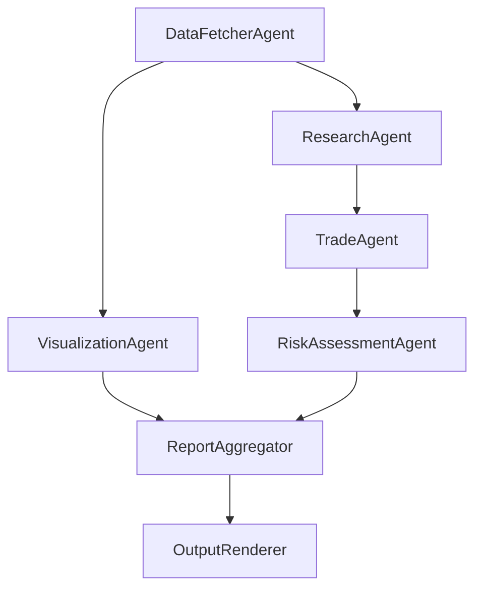

<think>
好的，我需要帮助用户设计一个基于LangGraph的多Agent工作流程。用户已经有一些通过API获取数据的工具，并且有多个Agent分别负责数据获取、可视化、分析、交易和风险评估。最终需要将所有结果整合输出。

首先，我需要理解用户现有的代码结构。从提供的代码片段中，特别是`demo_stock_agent.py`和`chart_agent.py`，可以看到用户已经定义了StockAnalysisAgent、TechnicalAnalysisAgent和ChartExpertAgent等类，这些Agent使用不同的工具执行任务。例如，StockAnalysisAgent使用get_company_info等工具，而ChartExpertAgent使用create_technical_chart等工具。

接下来，用户的需求是将这些Agent组织成一个工作流程，使用LangGraph来管理节点和流程。根据用户描述，工作流程应包括以下步骤：数据获取Agent调用工具获取数据，可视化Agent生成图表，Research Agent分析数据，Trade Agent生成交易决策，Risk Agent评估风险，最后整合所有结果。

我需要参考LangGraph的设计模式，通常涉及定义节点（函数或Agent）和边（控制流）。每个节点执行特定任务，并将结果传递给下一个节点。同时，可能需要条件判断来决定流程分支。

首先，确定各个节点对应的现有Agent：

1. 数据获取Agent：可能对应StockAnalysisAgent或TechnicalAnalysisAgent，使用get_stock_trade_data等工具（如`individual_stock_tools.py`中的工具）。
2. 可视化Agent：对应ChartExpertAgent，使用create_technical_chart等工具。
3. Research Agent：可能需要一个新的Agent，或者扩展现有的StockAnalysisAgent，负责整合数据并进行分析。
4. Trade Agent：类似demo_stock_agent.py中的Trader Agent，根据分析结果生成交易建议。
5. Risk Agent：对应RiskManagerAgent，使用数据库查询工具进行风险评估。

然后，设计工作流程的结构。可能的流程是线性的：数据获取 → 可视化 → 分析 → 交易决策 → 风险评估 → 整合结果。但需要考虑每个步骤的依赖关系，例如可视化可能需要数据获取的结果，分析需要数据和可视化的结果等。

还需要考虑如何传递数据 between nodes。在LangGraph中，通常使用一个共享的状态字典，每个节点修改或添加部分状态。例如，数据获取节点将数据存入状态，可视化节点读取数据并生成图表，存入状态，依此类推。

另外，需要处理可能的错误或条件分支，比如如果数据获取失败，流程应终止或转向错误处理节点。但根据用户需求，可能暂时只需主要成功路径。

现在，根据这些思考，开始构建LangGraph的节点和Workflow。每个节点是一个函数，接收状态，返回更新后的状态。Workflow定义节点之间的边，可能包括并行执行（如数据获取和可视化是否可以同时进行）或顺序执行。

最后，整合所有结果，确保最终状态包含所需的所有输出，如数据、图表、分析结果、交易建议和风险评估。
</think>

根据需求，我基于您提供的代码库设计一个LangGraph工作流。以下是节点和流程设计：



```python:src/agents/stock_workflow.py
from langgraph.graph import StateGraph, END
from typing import TypedDict, List, Dict, Any
from agents.demo_stock_agent import StockAnalysisAgent, TechnicalAnalysisAgent
from agents.chart_agent import ChartExpertAgent
from tools.tech1_tools import analyze_stock_technical
from tools.analyst_tools import get_analyst_data_tool

# 定义状态结构
class AgentState(TypedDict):
    symbol: str
    raw_data: Dict[str, Any]
    visualizations: List[Dict]
    analysis_report: str
    trade_decision: Dict
    risk_assessment: Dict
    final_output: Dict

# 数据获取节点
def data_fetcher_node(state: AgentState):
    stock_agent = StockAnalysisAgent()
    tech_agent = TechnicalAnalysisAgent()
    
    # 获取基础数据
    fundamental_data = stock_agent.analyze({"input": f"获取{state['symbol']}基本面数据"})
    technical_data = tech_agent.analyze({"input": f"获取{state['symbol']}技术面数据"})
    
    return {"raw_data": {**fundamental_data, **technical_data}}

# 可视化节点
def visualization_node(state: AgentState):
    chart_agent = ChartExpertAgent()
    
    # 生成技术图表
    tech_charts = chart_agent.analyze_and_plot(state["raw_data"]["technical_data"])
    
    # 生成基本面图表
    fund_charts = chart_agent.analyze_and_plot(state["raw_data"]["fundamental_data"])
    
    return {"visualizations": [*tech_charts, *fund_charts]}

# 研究分析节点
def research_node(state: AgentState):
    research_agent = StockAnalysisAgent()  # 可扩展自定义ResearchAgent
    analysis = research_agent.analyze({
        "input": f"综合分析数据：{state['raw_data']}"
    })
    return {"analysis_report": analysis}

# 交易决策节点 
def trade_node(state: AgentState):
    trade_agent = TechnicalAnalysisAgent()  # 可替换为专用TradeAgent
    decision = trade_agent.analyze({
        "input": f"根据分析报告生成交易决策：{state['analysis_report']}"
    })
    return {"trade_decision": decision}

# 风险评估节点
def risk_node(state: AgentState):
    risk_agent = StockAnalysisAgent()  # 可替换为专用RiskAgent
    assessment = risk_agent.analyze({
        "input": f"评估交易风险：{state['trade_decision']}"
    })
    return {"risk_assessment": assessment}

# 结果聚合节点
def aggregate_node(state: AgentState):
    return {
        "final_output": {
            "metadata": {"symbol": state["symbol"]},
            "raw_data": state["raw_data"],
            "charts": state["visualizations"],
            "analysis": state["analysis_report"],
            "trade": state["trade_decision"],
            "risk": state["risk_assessment"]
        }
    }

# 构建工作流
def create_workflow():
    workflow = StateGraph(AgentState)
    
    workflow.add_node("data_fetcher", data_fetcher_node)
    workflow.add_node("visualizer", visualization_node)
    workflow.add_node("researcher", research_node)
    workflow.add_node("trader", trade_node)
    workflow.add_node("risk_assessor", risk_node)
    workflow.add_node("aggregator", aggregate_node)
    
    # 设置边
    workflow.set_entry_point("data_fetcher")
    
    workflow.add_edge("data_fetcher", "visualizer")
    workflow.add_edge("data_fetcher", "researcher")
    
    workflow.add_edge("visualizer", "aggregator")
    workflow.add_edge("researcher", "trader")
    workflow.add_edge("trader", "risk_assessor")
    workflow.add_edge("risk_assessor", "aggregator")
    
    workflow.add_edge("aggregator", END)
    
    return workflow.compile()
```

关键设计要点：
1. **状态管理**：使用TypedDict维护全流程状态，包含原始数据、可视化结果、分析报告等
2. **节点分工**：
   - DataFetcher：调用现有工具（参考`tools/demo_stock_tools.py:1-37`）
   - Visualizer：使用ChartExpertAgent（参考`agents/chart_agent.py:9-62`）
   - Researcher：扩展StockAnalysisAgent实现综合分析
3. **并行处理**：数据获取后同时触发可视化和研究分析
4. **风控集成**：在交易决策后执行风险评估
5. **结果聚合**：最终节点整合所有输出

使用示例：
```python
# 初始化工作流
stock_workflow = create_workflow()

# 执行分析
result = stock_workflow.invoke({
    "symbol": "600519",
    "raw_data": {},
    "visualizations": [],
    "analysis_report": "",
    "trade_decision": {},
    "risk_assessment": {},
    "final_output": {}
})

# 获取最终输出
print(result["final_output"])
```

需要扩展的Agent建议：
1. 专用ResearchAgent：参考`prj_document/framework.md:36-41`中的Researcher Agent设计
2. 风险评估Agent：实现`prj_document/framework.md:138-158`中的风控逻辑
3. 交易Agent：结合`tools/analyst_tools.py:21-109`的分析师数据
